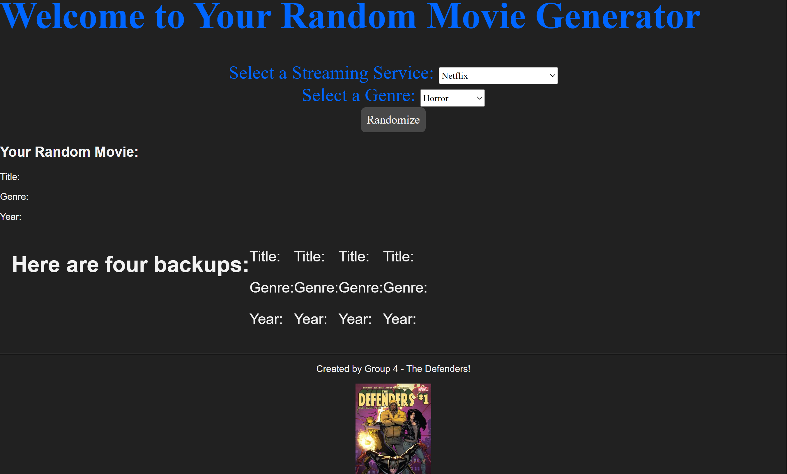
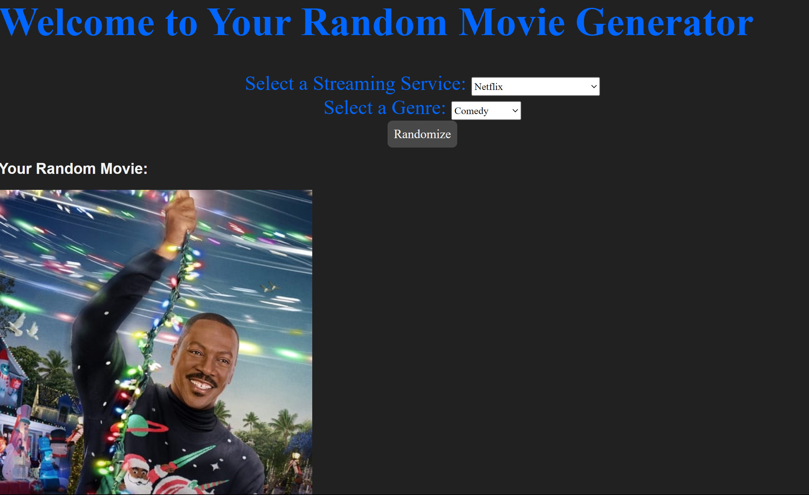

# Random Movie Generator

A website that takes user input, in the form of dropdown menus, and returns a random movie within a given Genre and Streaming Service.

## User Story

This is Project 1 within the UT Austin Full Stack Bootcamp. We were given no starter code for this and the teams were assigned by the instructional staff.

We were tasked with:
- Creating a website that could do anything of our choosing.
- The website needs to: 
    - use at least 2 seperate APIs
    - use a CSS frame work other than Bootstrap
    - be interactive
    - not use alerts, prompts, or confirms
    - use client side storage
    - be responsive
    - have a polished UI
    - have a clean repository
    - have a quality README
    - be added to our Module 2 challenge
- We then need to create a presentation that:
    - has an elevator pitch of 1-minute
    - tells our story and motivation
    - showcases the technology used, tasks that were given, roles, challenges, and successes
    - gives a demo of the site
    - directions for future development
    - and links to the deployed site and GitHub repo

## The Journey

This is the site, when first loaded, after one sit-down session...

And the site again, with a random movie generated...

Final layout with a movie... 

